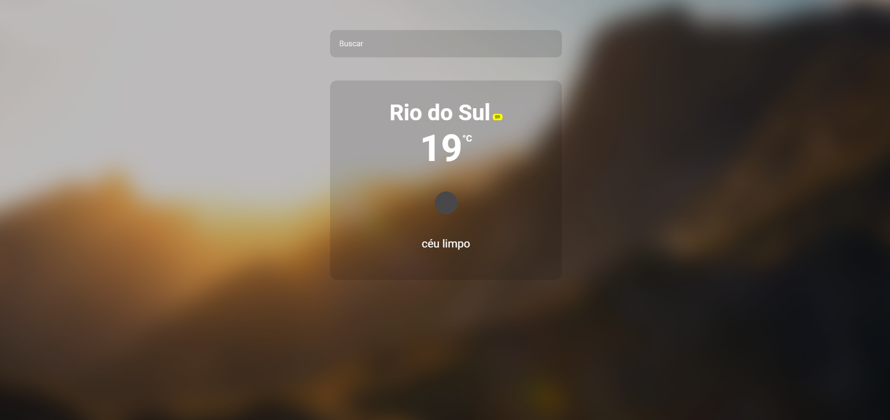

# React Weather
Um aplicativo meteorológico simples desenvolvido com React

##### [Live Demo](https://react-weather-raminhuk.vercel.app/) on Vercel

<p align="center">
  <a src="https://react-weather-raminhuk.vercel.app" target="_blanck"></a>
</p>

# API
+ Os dados meteorológicos são recuperados de http://openweathermap.org/

# Observação sobre a API
Os dados meteorológicos recuperados do Open Weather não são muito precisos. Na maioria das vezes, a previsão do tempo não está correta.

## 🚀 Getting Started

+ Clone este repositório 
```jsx
git clone https://github.com/raminhuk/react-weather.git
```
+ Entre na pasta react-weather
```jsx
cd react-weather
```
+ Execute npm install para instalar as dependências 
```jsx
npm install
```
+ Execute npm start para rodar o projeto em http://localhost:3000/
```jsx
npm start
```
